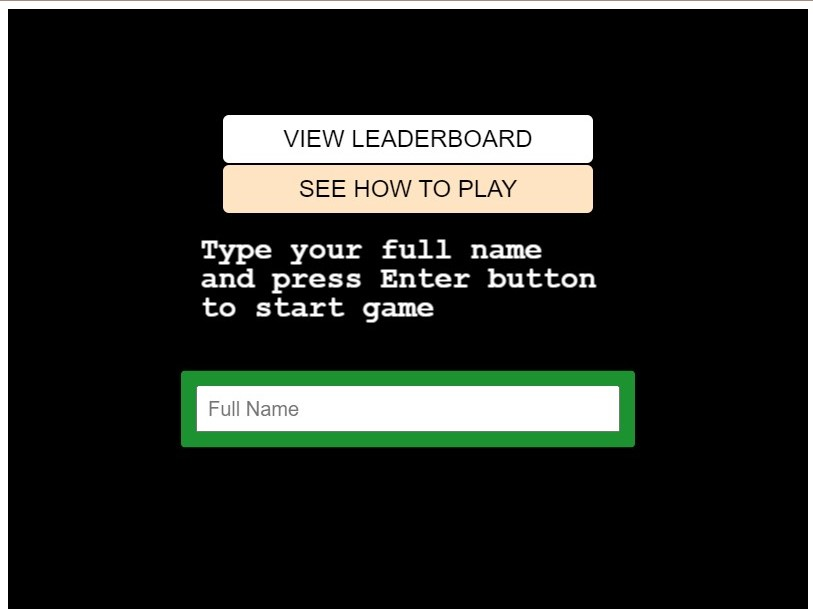

# Space Craft Shooter game
This project consists of building a video game using JavaScript (ES6) and the Phaser game engine.
## Game Design Document
The idea is to keep on earning scores by intercepting stars, and avoiding being killed by the spacecraft's bullets.

## How to play
* Move the player using the up, left and right keys.
* Fly up by pressing down the up arrow.
* A combination of the left or right arrow keys with the up arrow key may be required in some occations.
* Avoid been killed by keeping the enemy's bullet from hitting the player.

## Requirements

Node.js is required to install dependencies and run scripts via npm.
Usage

## Getting Started:

To get a local copy up and running follow these simple example steps:

1. Under the repository name, click the Clone or download green button.

2. Copy the URL given by clicking the clipboard button.

3. Open a terminal window in your local machine and change the current directory to the one you
   want the clone directory to be made, NOTE that a local server like wampserver is required.

4. Type  git clone and then paste the URL you previously copied to the clipboard.

5. Open a new terminal window in your local machine and change the current directory to your
   cloned directory.

6. Run `npm install` / `npm i` from the Terminal.

7. after that `npm run build` from the terminal.

8. Finally `npm start`.

## Testing

Run testing cases and Jest will print messages depending on the result

  $ npm run test

## See a live demo 

* LIVE DEMO **(https://mystifying-wilson-26a475.netlify.app)**

## Show your support
Give a ⭐️ if you like this project!

# Screenshot

* 

## Author

👤 **Gabriel Hilarion**

* Github: **[@gabrie-lhilarion](https://github.com/gabrie-lhilarion)**
* Twitter: **[@gabrielDeman](https://twitter.com/gabrielDeman)**
* Linkedin: **[linkedin](https://www.linkedin.com/in/gabrielhilarion/)**

## 🤝 Contributing

Contributions, issues and feature requests are welcome!

Feel free to check the [issues page]().
